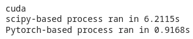

PyTorch implementation of the percent point function (PPF) for a Gaussian distribution, i.e., inverse CDF of a Gaussian distribution.

The goal is to enable using the PPF function in CUDA to go back and forth from a Gaussian to a Uniform distribution.

### Notes

The function emulates the behavior of ``scipy.special.ndtri`` but on either GPU or CPU.Tested on Google Colab with a T100, process got a **6x** improvement on GPU (performance is worse on CPU):

